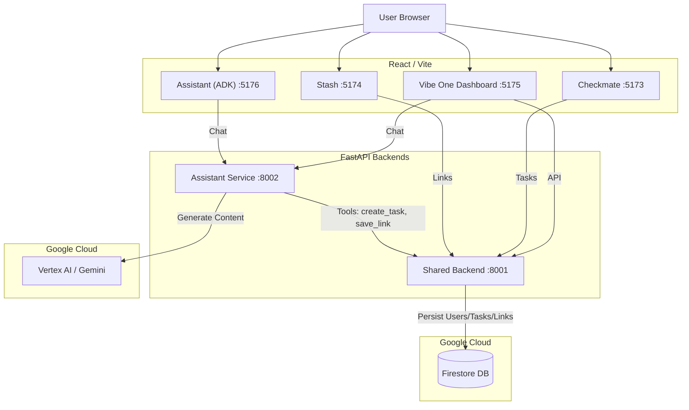

# 🏄 Vibe Coding Challenge: Unified Microservice Ecosystem

Welcome to the **Vibe One** ecosystem! This repository contains a fully integrated suite of applications: **Checkmate** (Tasks), **Stash** (Links), and **Vibe Assistant** (AI), all unified under a single SaaS Dashboard.

---

## 🏗️ Architecture Overview

The system is built as a **Microservice Architecture** with a Shared Backend and specialized services.



### Core Services
1.  **Shared Backend (Port 8001)**: 
    *   **Tech**: FastAPI, Python.
    *   **Role**: Central Authentication (JWT), Persistence (In-Memory/Firestore), Business Logic for Tasks & Links.
    *   **Data**: Stores Users, Tasks, and Links.

2.  **Assistant Service (Port 8002)**:
    *   **Tech**: **Google GenAI Agent Development Kit (ADK)**, FastAPI, Vertex AI.
    *   **Role**: Intelligent Agent built with the **ADK Framework**.
    *   **Features**: Function Calling (`create_task`, `save_link`) using the Shared Backend APIs.

3.  **Vibe One Frontend (Port 5175)**:
    *   **Tech**: React, Vite, Material UI.
    *   **Role**: Unified Dashboard hosting all sub-apps.
    *   **Modules**:
        *   `/checkmate`: Task Manager.
        *   `/stash`: Link Aggregator.
        *   `/assistant`: AI Chat Interface.

---

## 📦 Projects & Features

### 1. Checkmate (Task Manager)
*   **Smart Parsing**: Paste raw text, and it extracts tasks automatically.
*   **Dual Mode**: Works for Guests (Local Storage) and Authenticated Users (Backend).
*   **Features**: Add, Edit, Delete, Toggle Status, Priority Sorting.

### 2. Stash (Link Aggregator)
*   **Metadata fetching**: Automatically fetches Title, Description, and Images for saved URLs.
*   **Visual Cards**: diverse layout options (List/Grid).
*   **Secure**: Protected by Vibe One Authentication.

### 3. Vibe Assistant (AI Agent)
*   **Natural Language**: Chat with your data. "Remind me to call John" or "Save this link".
*   **Tool Use**: The AI actively calls backend APIs to perform actions.
*   **Context Aware**: Knows who you are and where your data lives.

### 4. Vibe SaaS (Dashboard)
*   **Unified Auth**: Single Sign-On (SSO) experience across all apps.
*   **App Launcher**: Central hub to access Checkmate, Stash, and Assistant.

---

## 🚀 Deployment Guide

You can run the entire ecosystem on a single server using the provided startup script.

### Prerequisites
*   **Python 3.10+** (Virtual Environments recommended)
*   **Node.js 18+** & **npm**
*   **Google Cloud Credentials** (for Vertex AI)

### ⚡ Rapid Start (Recommended)
We have provided a robust script to launch all services in the background (`nohup`), ensuring they stay running even after you disconnect.

1.  **Grant Execution Permissions**:
    ```bash
    chmod +x start_all.sh
    ```

2.  **Run the Script**:
    ```bash
    ./start_all.sh
    ```

3.  **Access the App**:
    *   Go to: `http://localhost:5175` (or your server's IP).
    *   **Login**: Create a new account or use existing credentials.

### � Debugging & Logs
Since services run in the background, you can monitor their status using the provided script:
```bash
./monitor_logs.sh
```
Or manually view specific logs:
*   `tail -f shared_backend.log` (Auth/Tasks/Links errors)
*   `tail -f assistant_backend.log` (AI/Agent errors)
*   `tail -f saas_frontend.log` (Frontend build/runtime errors)

**Common Issues:**
*   **Authentication Failed**: Check `shared_backend.log`. If the backend failed to start (e.g., missing dependencies), login will fail.
*   **Port In Use**: The start script tries to kill old processes, but you can manually check with `lsof -i :8001`.

### �📝 Manual Startup
If you prefer to run services individually (e.g., for debugging):

1.  **Shared Backend**:
    ```bash
    cd 2-Stash/backend && source venv/bin/activate
    uvicorn main:app --reload --port 8001
    ```
2.  **Assistant Backend**:
    ```bash
    cd 4-PersonalAssistant/backend && source venv/bin/activate
    uvicorn main:app --reload --port 8002
    ```
3.  **Frontend**:
    ```bash
    cd 3-SaaS && npm run dev -- --port 5175
    ```

---

## 🔧 Service Ports Table

| Service | Port | Description |
| :--- | :--- | :--- |
| **Shared Backend** | `8001` | Core API (Auth, Data) |
| **Assistant Backend** | `8002` | AI Agent API |
| **Vibe One (Frontend)** | `5175` | Main Dashboard |
| *Checkmate (Indep.)* | *5173* | *Standalone Dev Mode* |
| *Stash (Indep.)* | *5174* | *Standalone Dev Mode* |
| *Assistant (Indep.)* | *5176* | *Standalone Dev Mode* |

---

## 🌍 Remote Access (Internet)

If you are accessing these apps from a different machine (not one you are SSH'd into), you must:

1.  **Open Firewall Ports**: Allow Inbound TCP on `8001`, `8002`, `5173`, `5174`, `5175`, `5176`.
2.  **Run Start Script**: The `start_all.sh` script will **automatically detect your Public/Host IP** and configure the Frontends (`.env` files) to point to the Backends.

    ```bash
    ./start_all.sh
    ```
    *It will print the detected IP during startup.*

---

*Built for the Vibe Coding Challenge.*
